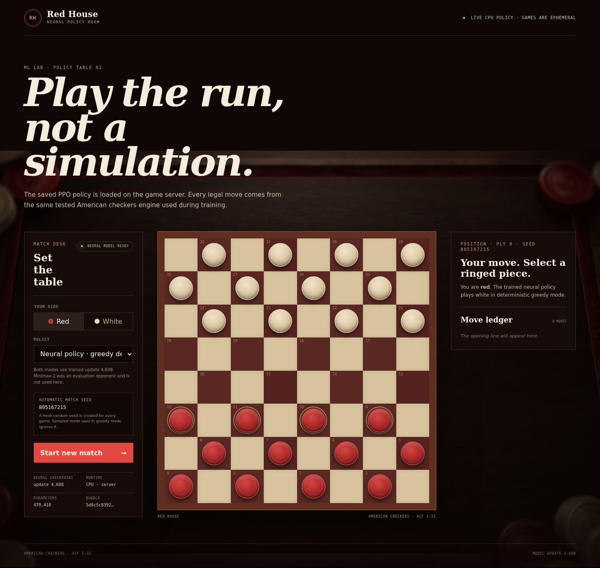
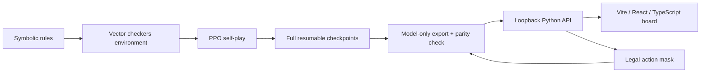

# PPO Checkers

[](https://github.com/goldbar123467/PPO-Checkers/actions/workflows/offline-ci.yml)
[](LICENSE)
[](https://checkers.upsidedownatlas.com)

A complete, reproducible machine-learning system for American checkers: symbolic rules, a Gym-style environment, PPO self-play, checkpoint recovery, powered evaluation, a model-only export, a React game client, and a hardened CPU deployment. The playable interface is branded **Red House**.

**[Play the trained neural policy](https://checkers.upsidedownatlas.com)**



## What this project proves

The browser opponent is a real neural network trained by PPO self-play. It is not Minimax wearing a neural label. The Python rules engine still owns legal moves, mandatory captures, multi-jumps, promotion, repetition, and terminal results; the network only scores the 128 fixed action slots and estimates position value.

Two play modes expose the same saved policy:

- **Neural · Greedy** selects the highest-logit legal action deterministically.
- **Neural · Sampled** samples from the masked neural distribution. Every match receives a fresh cryptographically generated 32-bit seed, displayed read-only for replay/debugging.

Minimax-2 appears only as a controlled evaluation baseline. It is not used for web play.

PPO was chosen because the engineering question was whether a policy/value network could learn from self-play and survive the whole train–evaluate–export–serve lifecycle. Minimax would be a simpler way to make a competent checkers opponent, but it would answer a different question. Keeping Minimax as an evaluation anchor makes that distinction testable.

## Headline evidence

The deployed policy is update 4608, selected as the highest-scoring persisted checkpoint that had a full ballot evaluation. On 216 fixed openings, played from both colors:

| Opponent | Games | W / D / L | Score | Approx. 95% interval |
|---|---:|---:|---:|---:|
| Random | 432 | 432 / 0 / 0 | 1.0000 | 0.9912–1.0000 |
| Project Minimax-2 | 432 | 354 / 70 / 8 | 0.9005 | 0.8686–0.9253 |

The final update 6144 regressed to 0.8611 against Minimax-2. That adverse result is retained rather than hidden. This is one practice-run seed, the checkpoint-selection suite was reused, and Minimax-2 is a shallow internal proxy—not an expert rating. Human strength and sealed-test performance are **not evaluated**.

| Artifact fact | Measured value |
|---|---:|
| Network parameters | 470,410 |
| Model-only bundle | 1,905,669 bytes (1.82 MiB) |
| Training transitions | 50,331,648 |
| Measured rollout/optimization time | 77,845 s (21 h 37 m) |
| Total invocation wall counters | 82,171 s (22 h 49 m) |
| Peak recorded GPU memory | 11,923 MiB |
| Deployment steady RSS | about 160 MiB |
| Deployment neural reply at origin | 7 ms in the recorded smoke |

The compact machine-readable evidence is [reports/checkers_practice_release_v1.json](reports/checkers_practice_release_v1.json); the production image, runtime, and exercised rollback are recorded in [reports/checkers_deployment_v1.json](reports/checkers_deployment_v1.json). Methodology and caveats are in [docs/evaluation.md](docs/evaluation.md) and [docs/results.md](docs/results.md).

## System shape



The network takes an `8 × 8 × 8` actor-canonical observation, passes it through a 64-channel stem and six GroupNorm residual blocks, then branches into a 128-logit policy head and a bounded scalar value head. See [docs/architecture.md](docs/architecture.md).

## Run it locally

Prerequisites are Linux/WSL2, Python 3.12, [uv](https://docs.astral.sh/uv/), Node.js 22, and npm. A GPU is not required to play.

```bash
git clone https://github.com/goldbar123467/PPO-Checkers.git
cd PPO-Checkers
uv sync --locked --all-groups
npm --prefix web/checkers ci

mkdir -p models/checkers/policies
gh release download checkers-policy-v1 \
  --pattern 'checkers-practice-update-004608.pt*' \
  --dir models/checkers/policies

policy=models/checkers/policies/checkers-practice-update-004608.pt
test "$(sha256sum "$policy" | cut -d ' ' -f1)" = "$(tr -d '\n' < "$policy.sha256")"
```

Terminal 1:

```bash
PYTHONPATH=src .venv/bin/python scripts/serve_checkers_web.py \
  --bundle models/checkers/policies/checkers-practice-update-004608.pt \
  --port 8765
```

Terminal 2:

```bash
npm --prefix web/checkers run dev
```

Open `http://127.0.0.1:5173`. For a single production-style local process, build the client and pass `--static-dir web/checkers/dist` to the Python command. Full instructions are in [web/checkers/README.md](web/checkers/README.md).

## Train it exactly

Training is a substantial CUDA experiment, not part of local play. The accepted practice profile requires a clean Git worktree, one CUDA GPU, online W&B logging, and a mandatory manual review after update 1024.

```bash
read -rsp 'W&B API key: ' WANDB_API_KEY && printf '\n'
export WANDB_API_KEY

PYTHONPATH=src .venv/bin/python scripts/preflight_practice.py \
  --config configs/checkers-practice.yaml \
  --output-dir runs/practice-preflight-reproduction

run_dir=runs/checkers-practice-seed0-reproduction
PYTHONPATH=src .venv/bin/python scripts/train.py \
  --config configs/checkers-practice.yaml \
  --output-dir "$run_dir"
```

The first invocation deliberately pauses after update 1024. Inspect its manifest, evaluation, metrics, and resource headroom; then resume the same run:

```bash
PYTHONPATH=src .venv/bin/python scripts/train.py \
  --config configs/checkers-practice.yaml \
  --output-dir "$run_dir" \
  --resume "$run_dir/checkpoints/update-001024.pt"
```

Do not assume the final checkpoint is best. Compare only fully evaluated persisted checkpoints before export. [docs/training.md](docs/training.md) records every hyperparameter, the pause/resume sequence, artifact validation, and the measured runtime.

## Verify the repository

```bash
make check
npm --prefix web/checkers audit --audit-level=moderate
npm --prefix web/checkers test
npm --prefix web/checkers run typecheck
npm --prefix web/checkers run build
```

`make check` runs formatting, Ruff, strict mypy, the full pytest suite with a 92% coverage floor, and the deterministic property-test gate. CI runs that Python gate in an egress-blocked network namespace and validates the frontend independently without downloading model weights.

## Repository map

```text
src/checkers/        rules, environments, agents, PPO, evaluation, web service
configs/             frozen experiment profiles
scripts/             training, recovery, evaluation, export, and serving CLIs
tests/               rules, properties, RL oracles, recovery, and web tests
web/checkers/        Vite + React + TypeScript client
deploy/checkers/     pinned CPU container and Caddy ingress
reports/             immutable and compact experiment evidence
docs/                architecture, training, evaluation, deployment, and rules
```

Full checkpoints, optimizer state, run histories, credentials, caches, and model weights are intentionally excluded from Git. The small model-only bundle is distributed as a checksummed GitHub Release asset.

## Lessons learned

- A policy should rank moves; it should not be trusted to invent legality. Keeping rules symbolic made forced-capture and multi-jump defects testable.
- PPO perspective signs, rollout chronology, CUDA device identity, and exact resume state were more failure-prone than the network itself.
- Training loss did not answer whether the model could play. Color-balanced games, fixed openings, confidence intervals, and adverse checkpoint movement did.
- Checkpoint selection was harder than “take the last file”: update 6144 was worse than update 4608 on the declared proxy.
- A 470k-parameter network is cheap to serve. The full checkpoint was 735 MB because it also held optimizer, league, collector, and RNG state; the inference bundle is only 1.82 MiB.
- Deployment exposed a real permissions failure when a `0600` model was mounted into an unprivileged container. Production now uses a read-only, checksum-verified artifact.

## Documentation

- [Architecture](docs/architecture.md)
- [Experiment contract](docs/experiment-contract.md)
- [Training and exact reproduction](docs/training.md)
- [Evaluation methodology](docs/evaluation.md)
- [Results and limitations](docs/results.md)
- [Deployment, operations, and rollback](docs/deployment.md)
- [Model card](docs/model-card.md)
- [American-checkers rule traceability](docs/RULES.md)
- [PPO implementation decisions](docs/PPO_CHECKLIST.md)
- [Web-harness acceptance contract](docs/CHECKERS_WEB_HARNESS_CONTRACT.md)
- [Clean-room UI reference study](reports/checkers_web_reference_study.md)

## License and roadmap

Code and the `checkers-policy-v1` PyTorch bundle are released under the [MIT License](LICENSE). The generated table background is original project output; its provenance is recorded in the web-harness contract.

The next model-delivery milestone is an ONNX/browser-native export with PyTorch-to-ONNX action parity. Per the project licensing decision, that future Hugging Face ONNX release will be Apache-2.0 and clearly separated from this MIT release. Longer-term work includes search-guided policy/value play, stronger sealed evaluation, physical-board vision, and robot manipulation.
