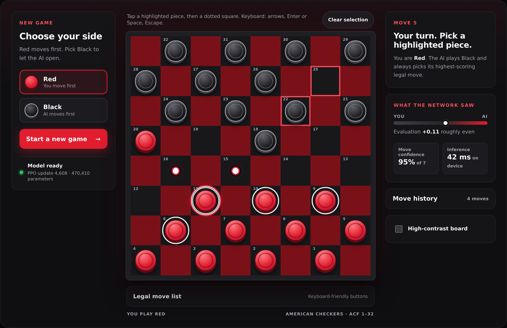

# PPO Checkers

**A checkers AI trained from scratch with Proximal Policy Optimization, playable in your browser.**

[](https://github.com/goldbar123467/PPO-Checkers/actions/workflows/offline-ci.yml)
[](LICENSE)
[](https://vercel.com/new/clone?repository-url=https%3A%2F%2Fgithub.com%2Fgoldbar123467%2FPPO-Checkers&project-name=ppo-checkers&repository-name=ppo-checkers)



This repository is a complete, reproducible reinforcement-learning system for American checkers: a bitboard rules engine, a vectorized self-play environment, a PPO trainer with exact resume, a color-balanced evaluation harness, and a static website where anyone can play the trained network.

The opponent on the website is the real 470,410-parameter policy/value network, not a scripted engine. It runs **entirely in the browser**. The trained PyTorch bundle is exported to raw float32 weights, and a dependency-free TypeScript forward pass evaluates positions in a Web Worker. The site needs no inference server, so it deploys to Vercel as plain static files.

## Highlights

- **Self-play PPO from zero knowledge.** Clipped PPO with signed two-player GAE, a snapshot league of past policies, and a 128-slot legal-action mask. No expert games, no search.
- **Rules you can trust.** Mandatory captures, multi-jumps, promotion, the 40-move rule, and threefold repetition are symbolic, checked by an independent oracle, property tests, and [published perft counts](tests/golden/data/external_perft.json).
- **Honest evaluation.** 216 fixed openings played from both colors, confidence intervals, and adverse checkpoints kept rather than hidden.
- **Browser-native inference with proven parity.** The TypeScript rules engine and network replay 43 recorded games move-for-move against the Python engine and match PyTorch logits within 1e-4, including every recorded greedy decision.
- **Private by construction.** No accounts, cookies, analytics, or network calls after the 1.9 MB of weights load.

<p align="center">
  
</p>

## Results

The deployed policy is update 4,608, selected as the highest-scoring persisted checkpoint that had a full ballot evaluation. On 216 fixed openings, played from both colors:

| Opponent | Games | W / D / L | Score | Approx. 95% interval |
|---|---:|---:|---:|---:|
| Random | 432 | 432 / 0 / 0 | 1.0000 | 0.9912–1.0000 |
| Project Minimax-2 | 432 | 354 / 70 / 8 | 0.9005 | 0.8686–0.9253 |

The final update, 6,144, regressed to 0.8611 against Minimax-2. That adverse result is kept. This is one practice-run seed, the checkpoint-selection suite was reused, and Minimax-2 is a shallow internal proxy, not an expert rating. Human strength and sealed-test performance are **not evaluated**.

| Fact | Value |
|---|---:|
| Network parameters | 470,410 |
| Browser weights (float32) | 1,881,640 bytes |
| Self-play transitions to update 4,608 | 37,748,736 |
| Full practice-run transitions | 50,331,648 |
| Measured rollout/optimization time | 77,845 s (21 h 37 m) |
| Peak recorded GPU memory | 11,923 MiB |
| In-browser inference per position | ~25–45 ms on a desktop CPU |

Machine-readable evidence is in [reports/checkers_practice_release_v1.json](reports/checkers_practice_release_v1.json). Methodology and caveats are in [docs/evaluation.md](docs/evaluation.md) and [docs/results.md](docs/results.md).

## How it works

```mermaid
flowchart LR
    R[Symbolic rules] --> E[Vectorized environment]
    E --> P[PPO self-play + snapshot league]
    P --> C[Resumable checkpoints]
    C --> X[Model-only bundle + parity check]
    X --> W[Browser export: float32 weights + manifest]
    W --> F[Parity fixtures from Python and PyTorch]
    F --> T[TypeScript rules + network in a Web Worker]
    T --> S[Static React site on Vercel]
```



The network reads an `8 × 8 × 8` observation from the mover's perspective (own and opposing men and kings, pending captures, the forced piece, and two game counters). A 64-channel `3 × 3` convolution stem and six GroupNorm residual blocks feed two heads: 128 policy logits (one per origin square and direction) and a `tanh` value. Illegal actions are masked before selection, so the network ranks moves but never decides legality. See [docs/architecture.md](docs/architecture.md).

## Run the website locally

Requires Node.js 20 or newer. The browser weights are committed, so no model download or Python is needed.

```bash
git clone https://github.com/goldbar123467/PPO-Checkers.git
cd PPO-Checkers
npm --prefix web/checkers ci
npm --prefix web/checkers run dev
```

Open `http://127.0.0.1:5173`. `npm --prefix web/checkers run build && npm --prefix web/checkers run preview` serves the production build with the same security headers as Vercel.

## Deploy to Vercel

The repository is configured by [vercel.json](vercel.json). Import it at [vercel.com/new](https://vercel.com/new) (or use the button above) and keep the defaults. Leave **Root Directory** at the repository root: `vercel.json` sets the install command, build command, output directory, security headers (including a strict Content-Security-Policy), and immutable caching for hashed assets. Social-preview URLs pick up the production domain automatically. Details are in [docs/deployment.md](docs/deployment.md).

## Re-export the model

Weights come from the checksummed `checkers-policy-v1` GitHub Release. To regenerate the browser export and its parity fixtures from that bundle:

```bash
uv sync --locked --all-groups
mkdir -p models/checkers/policies
gh release download checkers-policy-v1 \
  --pattern 'checkers-practice-update-004608.pt*' \
  --dir models/checkers/policies

PYTHONPATH=src .venv/bin/python scripts/export_browser_policy.py \
  --bundle models/checkers/policies/checkers-practice-update-004608.pt
```

The exporter verifies the bundle's SHA-256, writes `web/checkers/src/model/policy.{bin,json}`, reloads them and requires bit-identical tensors, then records the parity fixture that both test suites replay.

## Train it exactly

Training is a substantial CUDA experiment. The accepted practice profile requires a clean Git worktree, one CUDA GPU, online W&B logging, and a mandatory manual review after update 1,024.

```bash
read -rsp 'W&B API key: ' WANDB_API_KEY && printf '\n'
export WANDB_API_KEY

PYTHONPATH=src .venv/bin/python scripts/preflight_practice.py \
  --config configs/checkers-practice.yaml \
  --output-dir runs/practice-preflight-reproduction

run_dir=runs/checkers-practice-seed0-reproduction
PYTHONPATH=src .venv/bin/python scripts/train.py \
  --config configs/checkers-practice.yaml \
  --output-dir "$run_dir"
```

The first invocation pauses after update 1,024. Inspect its manifest, evaluation, metrics, and resource headroom, then resume the same run:

```bash
PYTHONPATH=src .venv/bin/python scripts/train.py \
  --config configs/checkers-practice.yaml \
  --output-dir "$run_dir" \
  --resume "$run_dir/checkpoints/update-001024.pt"
```

Do not assume the final checkpoint is best. Compare only fully evaluated persisted checkpoints before export. [docs/training.md](docs/training.md) records every hyperparameter, the pause/resume sequence, artifact validation, and the measured runtime.

## Verify

```bash
make check                                   # ruff format + lint, strict mypy, pytest (92% floor), property tests
npm --prefix web/checkers run lint
npm --prefix web/checkers run typecheck
npm --prefix web/checkers run test:coverage  # engine parity, perft, UI
npm --prefix web/checkers run build
npm --prefix web/checkers run test:e2e       # Playwright against the production build
```

CI runs the Python gate in an egress-blocked network namespace and the web gate (lint, types, unit and parity tests, build) independently.

## Repository map

```text
src/checkers/        rules, environments, agents, PPO, evaluation, policy export
configs/             frozen experiment profiles
scripts/             training, recovery, evaluation, and export CLIs
tests/               rules, properties, RL oracles, recovery, and export tests
web/checkers/        Vite + React + TypeScript site
  src/engine/        TypeScript rules engine, encoder, and network forward pass
  src/model/         exported browser weights and manifest
reports/             compact experiment evidence
docs/                architecture, training, evaluation, deployment, and rules
vercel.json          static hosting, headers, and caching
```

Full checkpoints, optimizer state, run histories, and credentials are excluded from Git. The model-only PyTorch bundle is a checksummed GitHub Release asset; only its small browser export is committed.

## Lessons learned

- A policy should rank moves, not invent legality. Keeping rules symbolic made forced-capture and multi-jump defects testable.
- PPO perspective signs, rollout chronology, CUDA device identity, and exact resume state were more failure-prone than the network itself.
- Training loss did not answer whether the model could play. Color-balanced games, fixed openings, confidence intervals, and adverse checkpoint movement did.
- Checkpoint selection was harder than "take the last file": update 6,144 was worse than update 4,608 on the declared proxy.
- A 470K-parameter network is cheap enough to run in a browser tab. The full training checkpoint was 735 MB because it held optimizer, league, collector, and RNG state; the inference weights are 1.9 MB.
- Porting an engine is only safe with a referee. Recording Python games and PyTorch outputs as fixtures turned "looks right" into move-for-move parity.

## Documentation

- [Architecture](docs/architecture.md)
- [Experiment contract (frozen at training time)](docs/experiment-contract.md)
- [Training and exact reproduction](docs/training.md)
- [Evaluation methodology](docs/evaluation.md)
- [Results and limitations](docs/results.md)
- [Deployment on Vercel](docs/deployment.md)
- [Model card](docs/model-card.md)
- [American-checkers rule traceability](docs/RULES.md)
- [PPO implementation decisions](docs/PPO_CHECKLIST.md)
- [Web app](web/checkers/README.md)

## License and roadmap

Code and the `checkers-policy-v1` weights are released under the [MIT License](LICENSE).

Next steps include an ONNX export for other runtimes (to be released separately under Apache-2.0), search-guided policy/value play, stronger sealed evaluation, and multiple full-budget training seeds.
