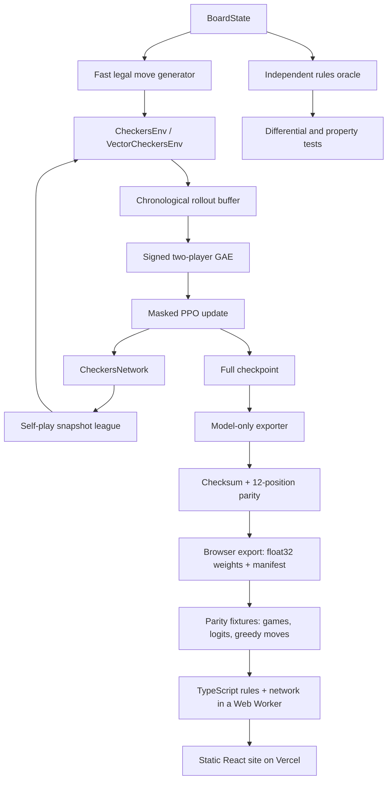

# Architecture

## Engineering objective

Build one checkers implementation that can train a policy, evaluate saved checkpoints, and let anyone play the selected model in a browser. The Python engine is the reference; the website runs a TypeScript port of the rules and network that is parity-tested against it, so the site can be hosted as static files with no inference server.

## Symbolic and learned responsibilities

| Concern | Authority |
|---|---|
| Board state, side to move, captures, promotion, continuation | `src/checkers/rules` |
| Legal 128-action mask and action decoding | `src/checkers/env` |
| Action logits and actor-relative value | `CheckersNetwork` |
| Greedy or seeded sampled selection among legal actions | `PolicyAgent` |
| Browser rules, encoding, inference, and rendering | `web/checkers/src/engine`, `web/checkers/src` |

The TypeScript engine in `web/checkers/src/engine` is a direct port of the Python rules, observation encoder, action encoding, and network forward pass. It is not an independent implementation that is trusted on its own: `scripts/export_browser_policy.py` records parity fixtures from the Python engine and PyTorch, and both the Python and TypeScript test suites replay them. The browser applies every human and model step through the ported environment, so a human can only submit moves from the current legal-action list.

## Observation and action spaces

Observations have shape `8 × 8 × 8` and are canonicalized to the current actor's perspective. The action space is a fixed 128-slot mapping. Before sampling or argmax, illegal logits are replaced with the lowest representable value; tests require finite distributions, legal samples, and zero illegal-logit gradients.

## Network

`CheckersNetwork` contains 470,410 trainable parameters:

1. An 8-to-64 channel `3 × 3` convolution, eight-group GroupNorm, and ReLU.
2. Six residual blocks. Each block has two 64-channel `3 × 3` convolutions and GroupNorm; the residual addition is followed by ReLU.
3. A policy head: `1 × 1` convolution to two channels, GroupNorm, ReLU, flatten, and `128 → 128` linear output.
4. A value head: `1 × 1` convolution to one channel, GroupNorm, ReLU, `64 → 64 → 1`, and `tanh`.

GroupNorm was chosen so behavior does not depend on batch-statistic state during self-play or single-position inference.

## Persistence boundary

Training checkpoints are full recovery artifacts: network, Adam state, schedules, counters, collector lanes, league snapshots, Python/NumPy/Torch/CUDA RNG state, AMP state, configuration, and provenance. They are large and never published in Git.

The public bundle contains only CPU network tensors and immutable provenance. Loading verifies its SHA-256 sidecar, uses `torch.load(..., weights_only=True)`, checks every field/tensor shape/dtype/finite value, and loads strictly.

## Browser boundary

`scripts/export_browser_policy.py` converts the verified bundle into `web/checkers/src/model/policy.bin` (470,410 little-endian float32 values, 1.88 MB) and `policy.json`, a manifest with tensor names, shapes, offsets, the weight SHA-256, and the source bundle's provenance. The exporter reloads the file into `CheckersNetwork` and requires bit-identical tensors before it writes fixtures.

In the browser, a Web Worker downloads the weights once, verifies their SHA-256 against the manifest, validates the tensor layout, and evaluates positions with a dependency-free forward pass (roughly 25–45 ms per position on a desktop CPU). The page thread keeps the game state and never blocks on inference. Games live only in memory; there are no accounts, cookies, analytics, or network calls after the weights load.
