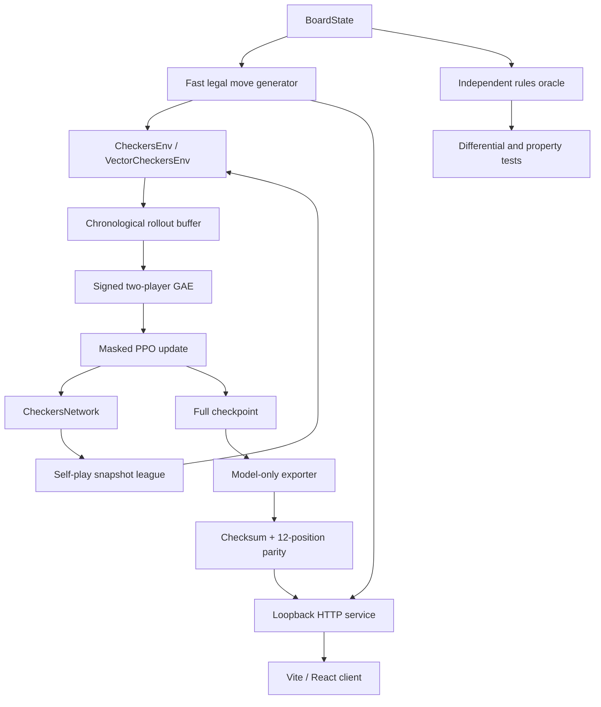

# Architecture

## Engineering objective

Build one checkers implementation that can train a policy, evaluate saved checkpoints, serve the selected model on CPU, and let a browser user play without duplicating game rules in TypeScript.

## Symbolic and learned responsibilities

| Concern | Authority |
|---|---|
| Board state, side to move, captures, promotion, continuation | `src/checkers/rules` |
| Legal 128-action mask and action decoding | `src/checkers/env` |
| Action logits and actor-relative value | `CheckersNetwork` |
| Greedy or seeded sampled selection among legal actions | `PolicyAgent` / web game service |
| Browser selection and rendering | `web/checkers` |

The browser receives a board snapshot and explicit legal human moves. It cannot submit an arbitrary model action, update the board locally, or override a forced continuation. The server applies every step through the same environment used by training.

## Observation and action spaces

Observations have shape `8 × 8 × 8` and are canonicalized to the current actor's perspective. The action space is a fixed 128-slot mapping. Before sampling or argmax, illegal logits are replaced with the lowest representable value; tests require finite distributions, legal samples, and zero illegal-logit gradients.

## Network

`CheckersNetwork` contains 470,410 trainable parameters:

1. An 8-to-64 channel `3 × 3` convolution, eight-group GroupNorm, and ReLU.
2. Six residual blocks. Each block has two 64-channel `3 × 3` convolutions and GroupNorm; the residual addition is followed by ReLU.
3. A policy head: `1 × 1` convolution to two channels, GroupNorm, ReLU, flatten, and `128 → 128` linear output.
4. A value head: `1 × 1` convolution to one channel, GroupNorm, ReLU, `64 → 64 → 1`, and `tanh`.

GroupNorm was chosen so behavior does not depend on batch-statistic state during self-play or single-position inference.

## Persistence boundary

Training checkpoints are full recovery artifacts: network, Adam state, schedules, counters, collector lanes, league snapshots, Python/NumPy/Torch/CUDA RNG state, AMP state, configuration, and provenance. They are large and never published in Git.

The public bundle contains only CPU network tensors and immutable provenance. Startup verifies its SHA-256 sidecar, uses `torch.load(..., weights_only=True)`, checks every field/tensor shape/dtype/finite value, loads strictly, and refuses to listen if any check fails.

## Serving boundary

The Python service loads the policy once and binds only to `127.0.0.1:8765`. It serves the built frontend and four JSON operations: health, model metadata, create game, and apply move. Sessions are in-memory, capped at 256 active games, expire after six idle hours, and intentionally disappear on restart. Eight bounded request workers, a 15-second socket timeout, a 16 KiB ingress body limit, structured route-normalized logs, and container resource limits bound abuse.

The public path is Cloudflare proxy → Caddy TLS → loopback Python. The origin firewall accepts ports 80/443 only from current Cloudflare networks.
